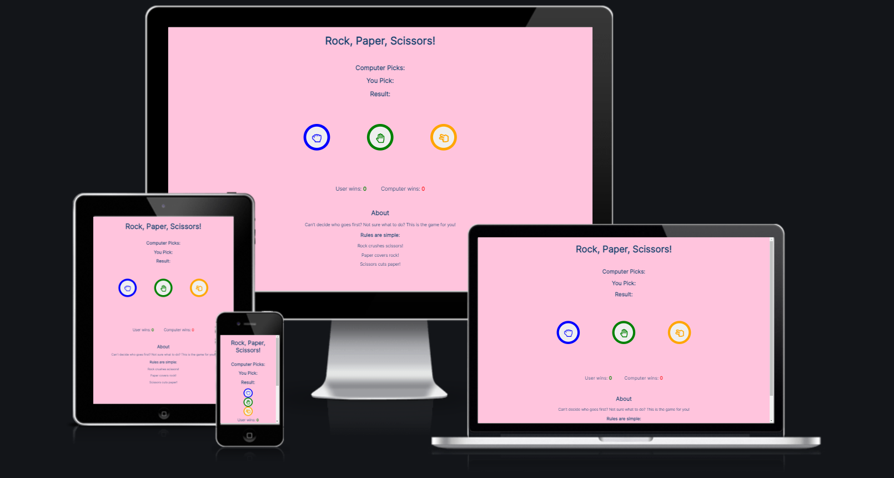

# Rock, Paper, Scissors

This was a project to create a game for someone to just enjoy or help them decide something. The game is something most people would have experienced as kids but online.

- __Published site available here: [Rock, Paper, Scissors!](https://cwilson1993.github.io/RPS-PP2/)__

## Features

### Exisiting Features
* ### Chosen Area
    * This is the first section on the page. 
    * It is blank at first but it is clear what the information is about.
    * Once the user makes their choice the computer makes a random choice and the result will populate.
    

* ### Choice Area
    * This section is simple but the idea is to have clear hand images to represent the choices.
    * The user clicks the button of their choice which will start the game.
    * The chosen button changes colour so that the user knows which one has been picked.
    

* ### Score Area
    * This section keeps track of who wins each round.
    * I wrote a JavaScript function which increments the score for whoever wins. If it is a draw then nothing changes.
    * The font colour of the scores is different so as to draw a clear distinction between who wins.
    

    