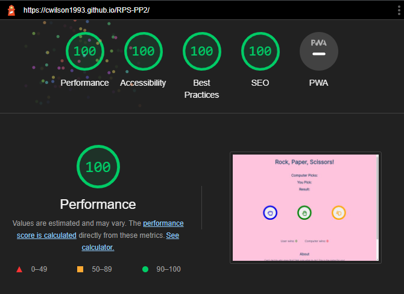

# Rock, Paper, Scissors

This was a project to create a game for someone to just enjoy or help them decide something. The game is something most people would have experienced as kids but online.

- __Published site available here: [Rock, Paper, Scissors!](https://cwilson1993.github.io/RPS-PP2/)__

## Features

### Exisiting Features
* #### Chosen Area
    * This is the first section on the page. 
    * It is blank at first but it is clear what the information is about.
    * Once the user makes their choice the computer makes a random choice and the result will populate.
    

* #### Choice Area
    * This section is simple but the idea is to have clear hand images to represent the choices.
    * The user clicks the button of their choice which will start the game.
    * The chosen button changes colour so that the user knows which one has been picked.
    

* #### Score Area
    * This section keeps track of who wins each round.
    * I wrote a JavaScript function which increments the score for whoever wins. If it is a draw then nothing changes.
    * The font colour of the scores is different so as to draw a clear distinction between who wins.
    

* #### About Section
    * This section is just a little information for people who may have never played before.
    * It gives a brief idea of what the game can be used for and what the rules are.
    

* ### Features For Future Version
    * I would like to add two more game types, one where the user choice is random and the other would allow two users to play.
    * I will implement sounds for when a user wins or loses. 

*** 

## Technologies

* HTML
    * In this project I used HTML as the language which gave the main structure to the website.
* JavaScript
    * JavaScript was used in this project to create the functionality of the website.
* CSS
    * I used CSS to style my website in an appealing and accessible way.
* [GitHub](https://github.com/)
    * GitHub was used to host the website and store the code in a repository.
* [Stack Overflow](https://stackoverflow.com/)
    * I used Stack Overflow to help with any issues I found when doing the project.
* [Font Awesome](https://fontawesome.com/)
    * I used Font Awesome icons for the buttons in the choice section.
* [Google Fonts](https://fonts.google.com/)
    * Google fonts was used in the project to import the desired font.

## Testing

For the testing I applied several different methods.
* Responsiveness testing
    * I used Google Chrome dev tools to see what my site looked like on different screen sizes and also used [Responsive Design Checker](https://responsivedesignchecker.com/).
    * I sent the site to my family and friends to help me test it across different devices. Below are some of the results.
        * Xiaomi Redmi Note 10 Pro - no issues.
        * IPhone 12 - no issues.
        * Samsung Galaxy tablet - no issues.
        * Desktop 1920 x 1080 - no issues.

* Google Lighthouse
    * I used Google Lighthouse to measure the performance of the site on mobile and desktop screens.
     

